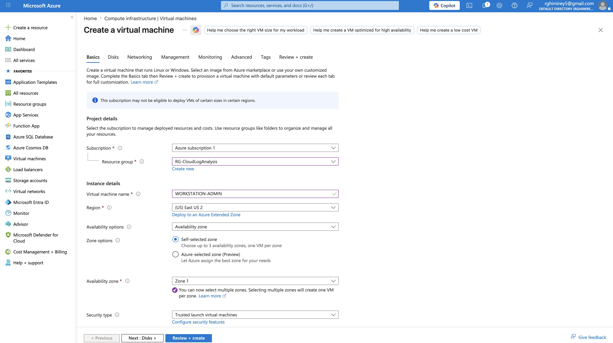
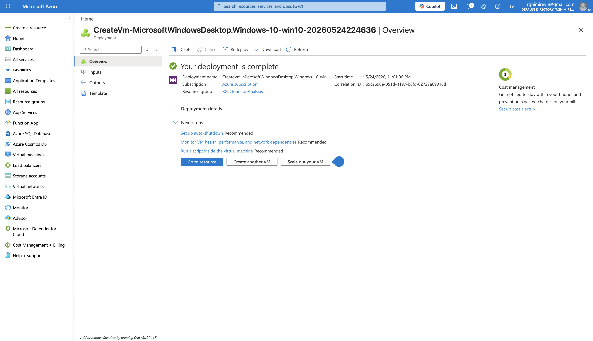
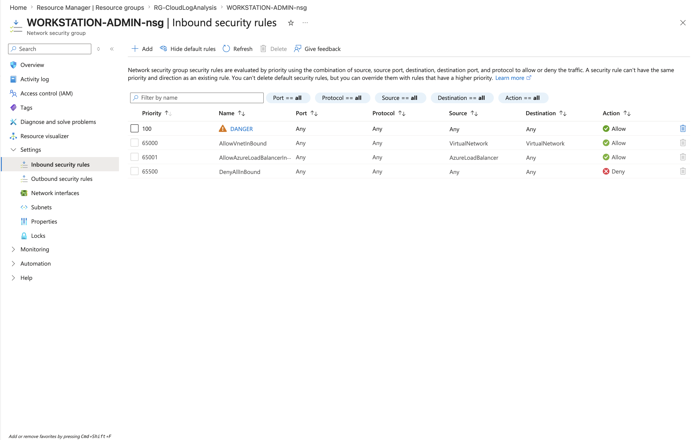
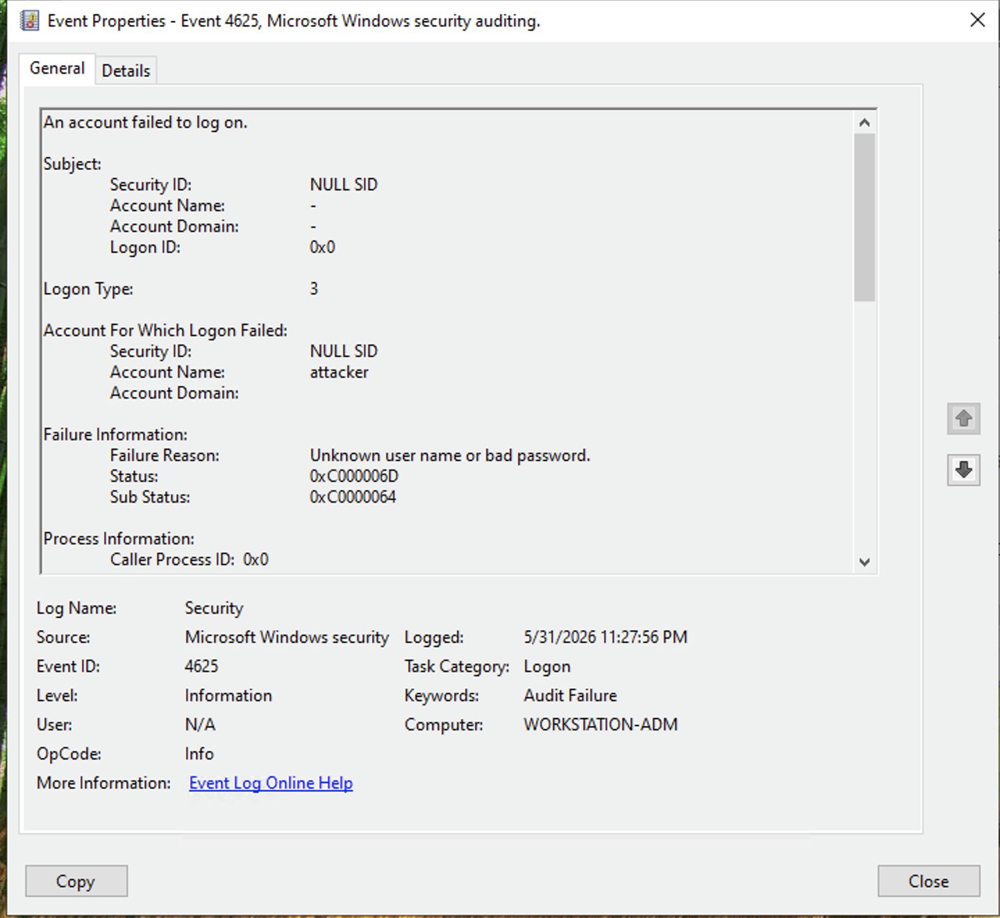
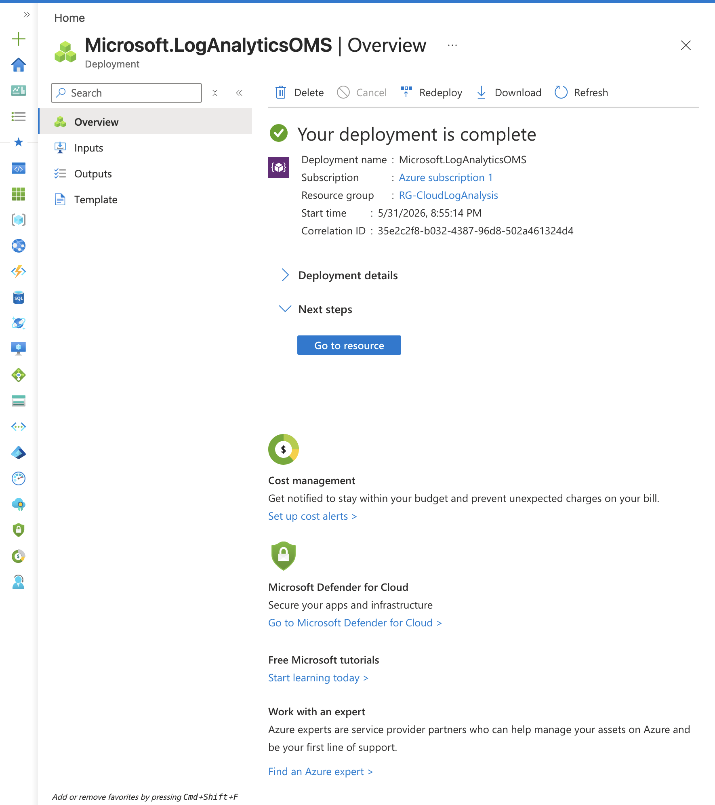
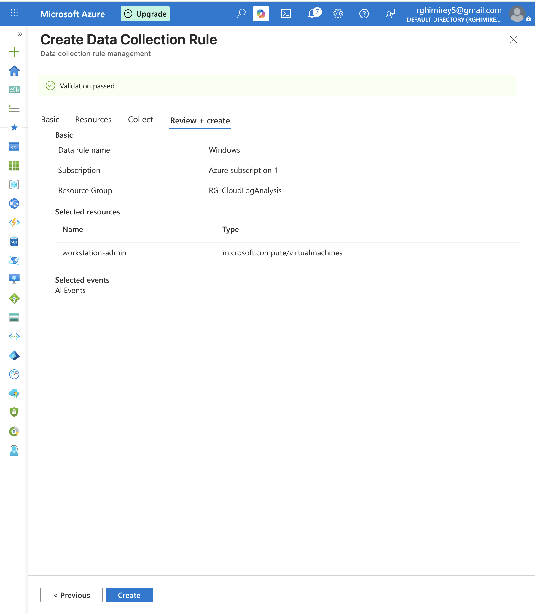
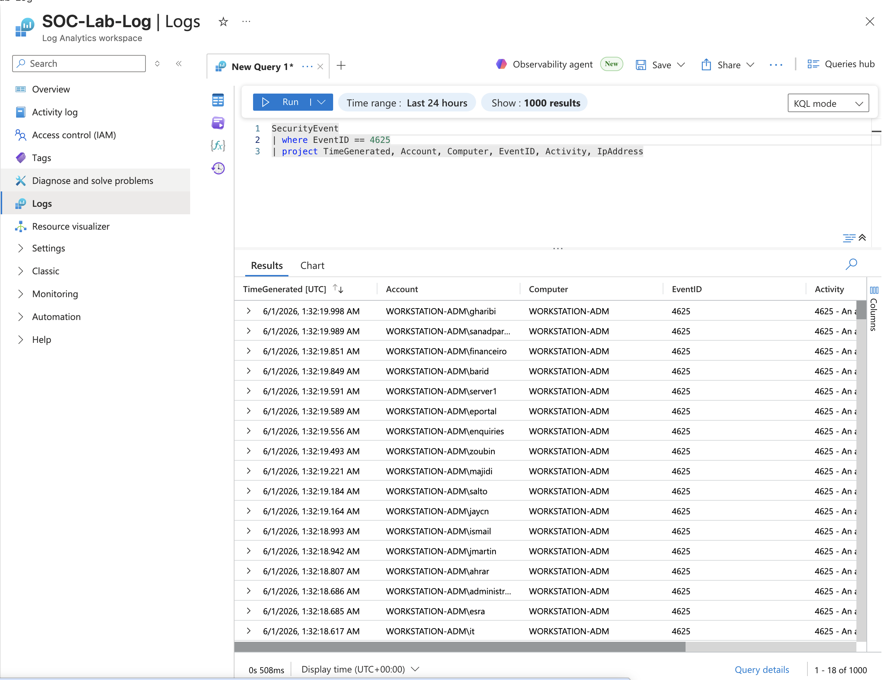
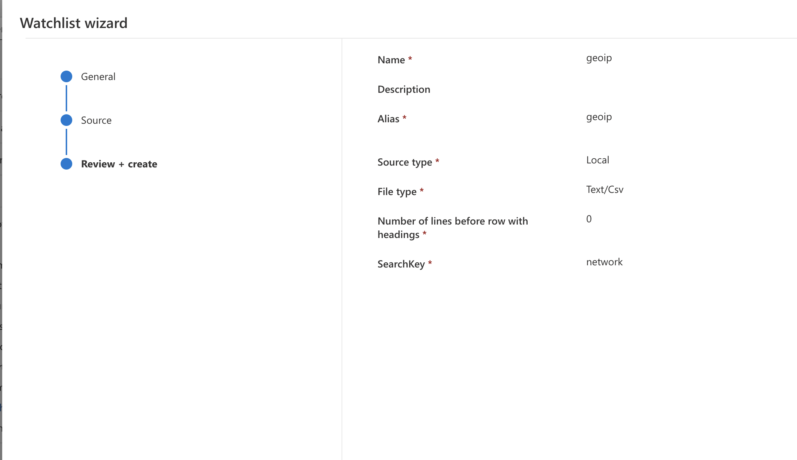
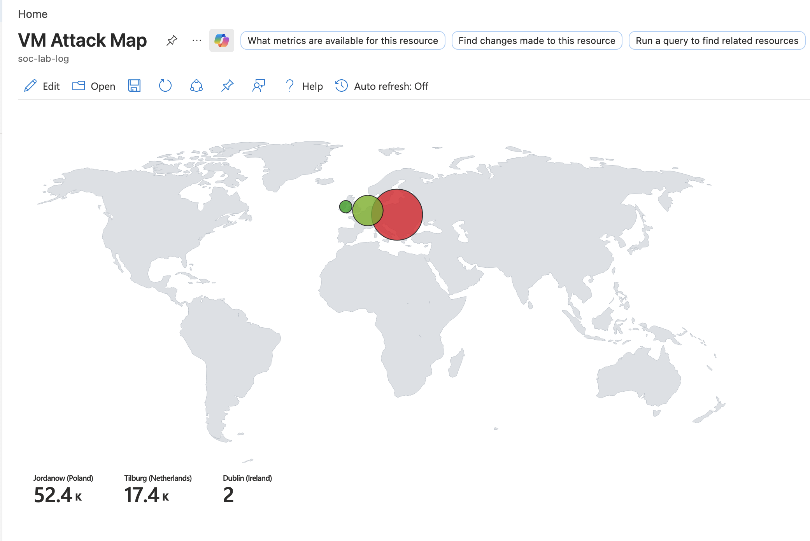

# Cloud Honeypot and Attack Analysis Lab

## Overview
For this project I built a home SOC lab in Microsoft Azure. I spun up a Windows VM and deliberately exposed it to the internet as a honeypot, so it would start picking up real brute-force RDP login attempts from actual attackers. From there I forwarded the logs to a Log Analytics Workspace, queried them with KQL, enriched the results with geolocation data, and plotted the attacks on a map.

This lab is based on [Josh Madakor's Cyber Home Lab tutorial](https://www.youtube.com/watch?v=g5JL2RIbThM). Everything in this repo is from my own run through the lab, using my own Azure environment and my own screenshots.

## Environment
- Cloud provider: Microsoft Azure (Free Tier)
- Honeypot VM: Windows Server VM (`workstation-admin`), exposed publicly via an NSG rule allowing all inbound traffic
- Log pipeline: Windows Security Event Logs sent to a Log Analytics Workspace through a Data Collection Rule
- Querying: Microsoft Defender Advanced Hunting / KQL
- Enrichment: a `geoip` watchlist joined against failed logon source IPs
- Visualization: Sentinel Workbook showing a world map of attacker locations

## Tools Used
- Azure Virtual Machines
- Azure Network Security Groups (NSG)
- Log Analytics Workspace and Data Collection Rules
- Microsoft Defender / Microsoft Sentinel Advanced Hunting
- Kusto Query Language (KQL)
- Sentinel Workbooks

## Steps

### 1. Created the honeypot VM
Spun up a Windows VM (`workstation-admin`) and confirmed it deployed successfully.

### 2. Exposed the VM to the internet
Set up an NSG rule (`DANGER`, priority 100) that allows all inbound traffic from any source, on purpose, so the VM would act as bait.

### 3. Watched the failed logins come in
Checked the raw Windows Security Event Logs on the VM and confirmed real brute-force RDP attempts were already hitting it.

### 4. Set up a Log Analytics Workspace
Created a workspace (`SOC-Lab-Log`) to collect the VM's security logs in one place.

### 5. Connected the VM to the workspace
Built a Data Collection Rule to onboard `workstation-admin` and stream its Windows Security Events into the workspace.

### 6. Queried the failed logons with KQL
Used Advanced Hunting to pull all failed RDP logon attempts (Event ID 4625) and looked at the results and a timeline of attempts over 24 hours.

### 7. Uploaded a geolocation watchlist
Uploaded a `geoip` watchlist to Sentinel that maps IP ranges to city, country, and lat/long, so it could be joined against the failed logon data.

### 8. Built the attack map
Joined the failed logon IPs against the geoip watchlist and plotted the results on a world map workbook, showing where the attacks were actually coming from.

## Skills Demonstrated
- Cloud infrastructure setup (Azure VM, NSG, Data Collection Rules)
- Log collection and centralization
- Threat detection and log analysis with KQL
- Data enrichment with IP geolocation
- SIEM visualization and workbook building
